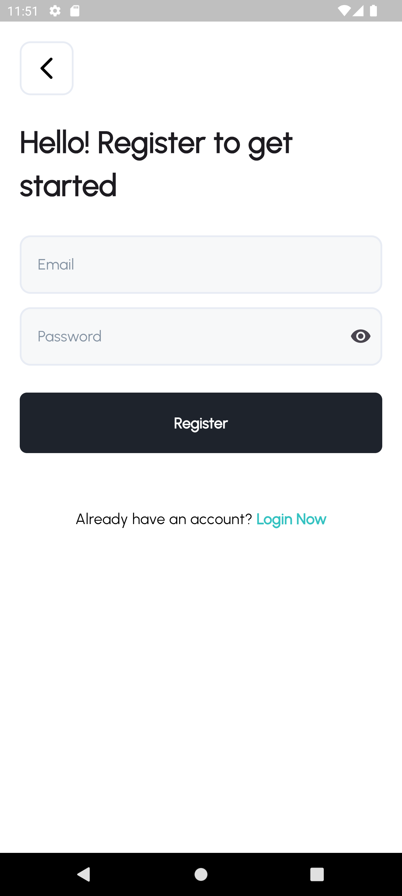
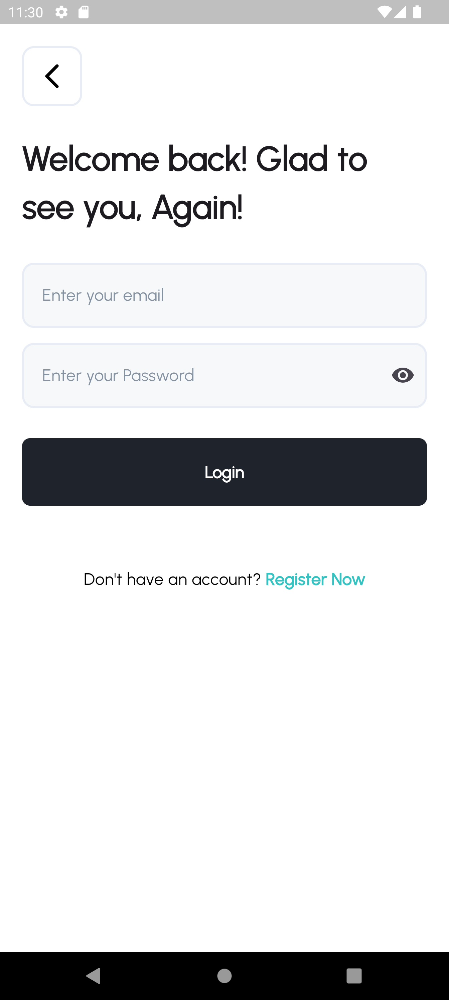
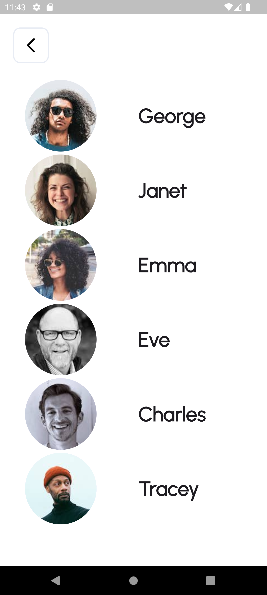

# Sumanel Technology Task

This Flutter project is a task for Sumanel Technology, showcasing a simple app with login, register, and home screens. The project uses **BLoC** state management and **Shared Preferences** to store the user token.

## Features

- **Login Screen**: Allows users to log in with their credentials.
- **Register Screen**: New users can create an account.
- **Home Screen**: Displays a list of users, showing their avatars and names.

## Technologies Used

- **Flutter**: For building the UI.
- **BLoC**: State management for handling the app's business logic.
- **Shared Preferences**: For local storage of the user token.
- **Dio**: For handling API requests.
- **Dartz**: For error handling.

## Screenshots

<div style="display: flex;">
    <div style="margin: 10px;">
        
        
        
    </div>
</div>


## How to Run

1. Clone the repository:
    ```bash
    git clone https://github.com/marcolous/Flutter-Sumanel_Technology.git
    ```
   
2. Navigate to the project directory:
    ```bash
    cd Flutter-Sumanel_Technology
    ```

3. Install dependencies:
    ```bash
    flutter pub get
    ```

4. Run the app:
    ```bash
    flutter run
    ```

## API

The app fetches a list of users from a mock API. The **Shared Preferences** are used to store and manage the token upon successful login or registration.

## State Management

The app uses the **BLoC** pattern for state management, ensuring a clear separation between the business logic and UI. It makes the app scalable and easy to maintain.

## Future Improvements

- Add error messages for failed login attempts.
- Implement pagination for the user list on the home screen.
- Add profile screens for each user.

## License

This project is licensed under the MIT License - see the [LICENSE](LICENSE) file for details.
